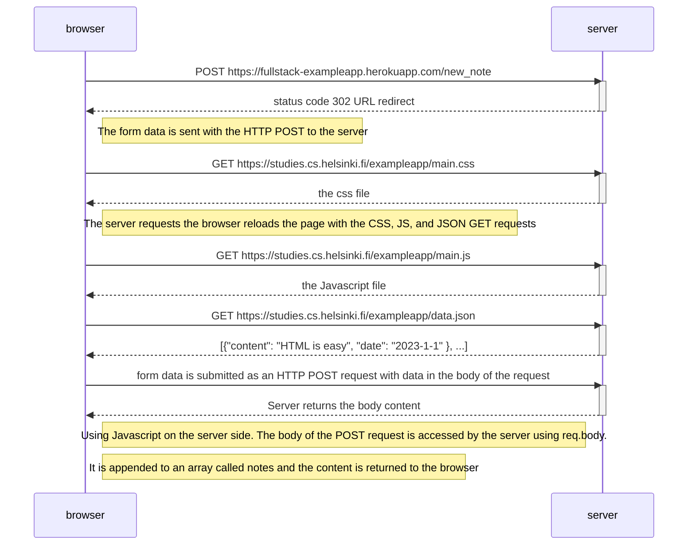

```mermaid
sequenceDiagram
    participant browser
    participant server

browser->>server: POST https://fullstack-exampleapp.herokuapp.com/new_note
activate server
server-->>browser: status code 302 URL redirect
deactivate server 
Note right of browser: The form data is sent with the HTTP POST to the server

browser->>server: GET https://studies.cs.helsinki.fi/exampleapp/main.css
activate server
server-->>browser: the css file
deactivate server
Note right of browser: The server requests the browser reloads the page with the CSS, JS, and JSON GET requests


browser->>server: GET https://studies.cs.helsinki.fi/exampleapp/main.js
activate server
server-->>browser: the Javascript file
deactivate server

browser->>server: GET https://studies.cs.helsinki.fi/exampleapp/data.json
activate server
server-->>browser: [{"content": "HTML is easy", "date": "2023-1-1" }, ...]
deactivate server

browser->>server: form data is submitted as an HTTP POST request with data in the body of the request
activate server
server-->>browser: Server returns the body content 
deactivate server
Note right of browser: Using Javascript on the server side. The body of the POST request is accessed by the server using req.body.
Note right of browser: It is appended to an array called notes and the content is returned to the browser
```