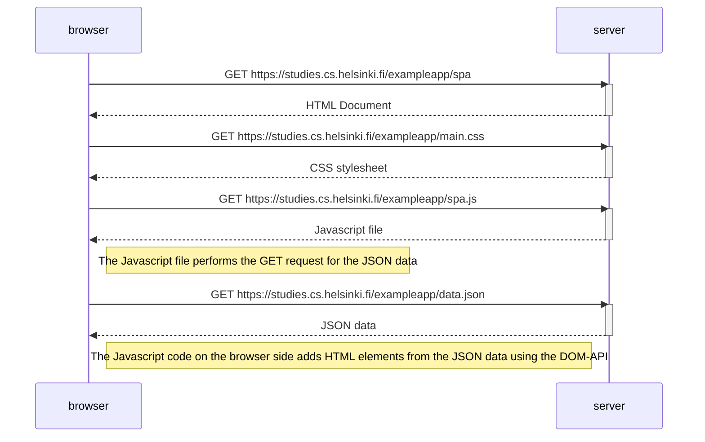

```mermaid
sequenceDiagram
    participant browser
    participant server

browser->>server: GET https://studies.cs.helsinki.fi/exampleapp/spa
activate server
server-->>browser: HTML Document
deactivate server

browser->>server: GET https://studies.cs.helsinki.fi/exampleapp/main.css
activate server
server-->>browser: CSS stylesheet
deactivate server

browser->>server: GET https://studies.cs.helsinki.fi/exampleapp/spa.js
activate server
server-->>browser: Javascript file
deactivate server
Note right of browser: The Javascript file performs the GET request for the JSON data

browser->>server: GET https://studies.cs.helsinki.fi/exampleapp/data.json
activate server
server-->>browser: JSON data
deactivate server
Note right of browser: The Javascript code on the browser side adds HTML elements from the JSON data using the DOM-API


```