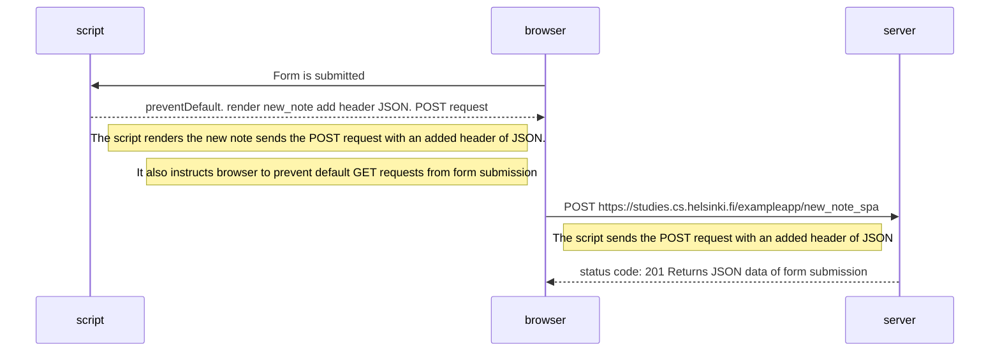

```mermaid
sequenceDiagram
    participant script
    participant browser
    participant server

browser->>script: Form is submitted
script-->>browser: preventDefault. render new_note add header JSON. POST request
Note left of browser: The script renders the new note sends the POST request with an added header of JSON.
Note left of browser: It also instructs browser to prevent default GET requests from form submission
browser->>server: POST https://studies.cs.helsinki.fi/exampleapp/new_note_spa
Note right of browser: The script sends the POST request with an added header of JSON 
server-->>browser: status code: 201 Returns JSON data of form submission
```